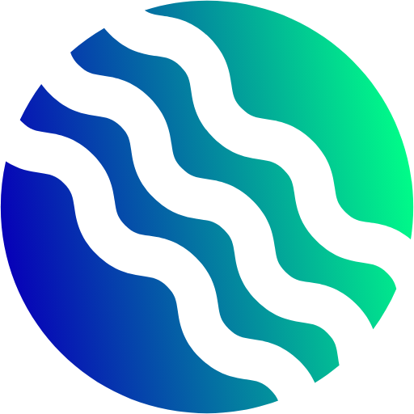

# Odyssey

Run your projects on [Odyssey](https://product.odyssey365.app/) boards from a conversation. Odyssey is
a planning and journaling app with tasks, notes, calendar, routines, and visual project boards. This
plugin pairs the Odyssey connector with skills that teach the model how to work a board well: which
container each item belongs in, when to lay a board out, and what needs your confirmation first.

It works in Claude (chat, Cowork, Claude Code) and in ChatGPT and Codex.

## Skills

| Skill | What it does | Try |
|---|---|---|
| `board-builder` | Turns a conversation, plan, or meeting notes into a board: tasks go into lists, notes become cards laid out in a grid, grouped by sections. | "Put this launch plan on a new Odyssey board." |
| `board-briefing` | Reads a board and reports progress per section and list, what is stuck, and the next steps. Read-only unless you ask it to post the briefing. | "Where are we on my Website Redesign board?" |
| `board-kanban` | Moves tasks between lists, marks them complete, adds new tasks to the right list, and takes items off a board. | "Move the three copy tasks to Done." |
| `board-mindmap` | Brainstorms as a mindmap on a board and turns chosen branches into tasks. | "Mindmap ideas for our spring campaign on my Marketing board." |

## Setup

1. Install the plugin.
2. Connect the **Odyssey** connector when prompted (in Claude: the plugin's **Connectors** tab) and
   sign in with your Odyssey account. You need an Odyssey account (iOS, Android,
   or the web).
3. Ask about one of your boards.

## Data and privacy

The skills are instructions only; they run no code of their own. All data goes through the Odyssey
MCP server at `https://mcp-odyssey30-60.odyssey365.app/`, which Odyssey365 operates. After you sign in
with OAuth, the server reads and changes only the connected account's tasks, notes, projects, and
related items, plus boards other people have shared with that account. Board comments posted at
your request notify the board's owner and members. Nothing is sent to any other service.

Deleting components or items, and posting comments, happen only after you confirm.

- Privacy policy: https://product.odyssey365.app/privacy-policy
- Terms of service: https://product.odyssey365.app/terms-of-service
- Support: https://product.odyssey365.app/contact

## License

MIT
